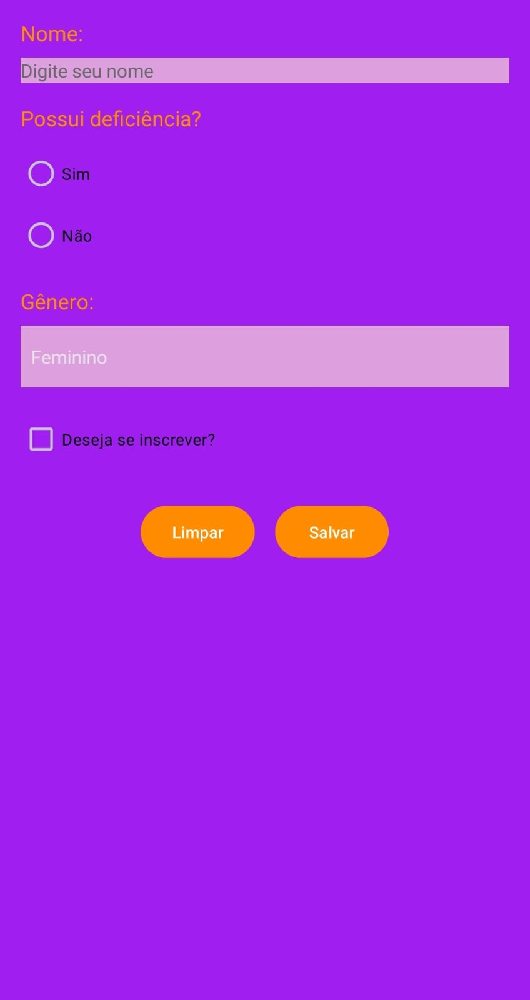

# App Android - [ Diário Emocional 💜]

Este é o meu primeiro aplicativo Android, desenvolvido utilizando o Android Studio como parte do meu aprendizado em desenvolvimento mobile. Atualmente, o projeto encontra-se na **fase inicial de desenvolvimento**.

## Status do Desenvolvimento

**Fase 1: Estrutura Básica e Protótipo Inicial**

Este aplicativo está atualmente na primeira etapa do seu desenvolvimento. 

As funcionalidades implementadas até o momento incluem:
Formulário de cadastro com TextView, EditText, Button, Toast, RadioGroup, RadioButton, CheckBox e Spinner

## Descrição e Objetivo:

O aplicativo Diário Emocional permite que os usuários registrem e analisem suas emoções diárias com base na Mandela das Emoções.  O objetivo é auxiliar o usuário no desenvolvimento do autoconhecimento emocional, ajudando o usuário a identificar padrões de humor e refletir sobre os acontecimentos que influenciam seu estado emocional ao longo do tempo.

## Demonstração Visual (Protótipo Inicial)

> **Observação:** O vídeo acima demonstra o protótipo inicial do aplicativo, mostrando as funcionalidades básicas implementadas até o momento. 

## Tecnologias Utilizadas

* Android Studio
* Linguagem de programação: Java 

